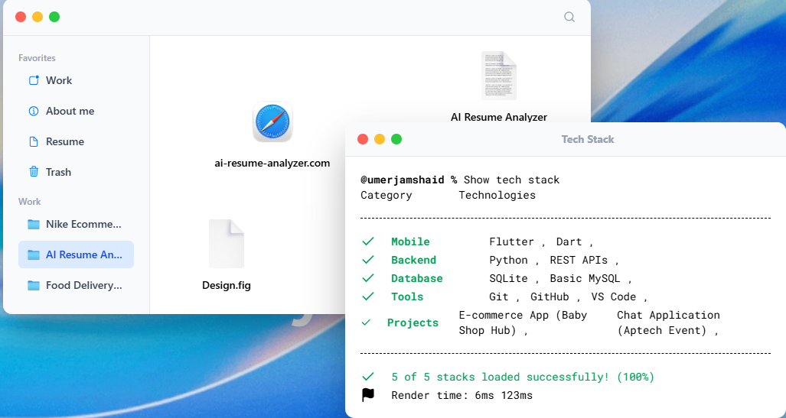
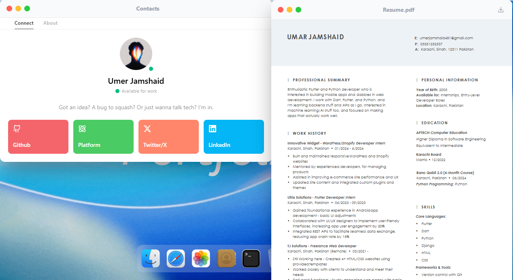

<a href="<YOUR_DEMO_LINK_HERE>" target="_blank" rel="noopener">
  <picture>
    <source media="(prefers-color-scheme: dark)" alt="macOS Portfolio" srcset="public/macbook.png" />
    
  </picture>
</a>

<h4 align="center">
  <a href="<YOUR_DEMO_LINK_HERE>">Live Demo</a> |
  <a href="https://github.com/Umerjamshaid/Mac_OS_Portfolio/issues">Report Bug</a> |
  <a href="https://github.com/Umerjamshaid/Mac_OS_Portfolio/issues">Request Feature</a>
</h4>

<div align="center">
  <h2>
    A pixel-perfect macOS desktop experience — built entirely in the browser. </br>
    Draggable windows · Dock magnification · Finder · Terminal · and more. </br>
  <br />
  </h2>
</div>

<br />
<p align="center">
  <a href="https://github.com/Umerjamshaid/Mac_OS_Portfolio/blob/main/LICENSE">
    </a>
  <a href="https://github.com/Umerjamshaid/Mac_OS_Portfolio/stargazers">
    </a>
  <a href="https://github.com/Umerjamshaid/Mac_OS_Portfolio/network/members">
    </a>
  <a href="https://github.com/Umerjamshaid/Mac_OS_Portfolio/commits/main">
    </a>
  <a href="https://github.com/Umerjamshaid/Mac_OS_Portfolio/issues">
    </a>
</p>

<div align="center">
  <figure>
    <a href="<YOUR_DEMO_LINK_HERE>" target="_blank" rel="noopener">
      
    </a>
    <figcaption>
      <p align="center">
        Fully interactive portfolio inspired by Apple's macOS — with real window management, animations, and more.
      </p>
    </figcaption>
  </figure>
</div>

<br />

---

## Table of Contents

- [Table of Contents](#table-of-contents)
- [Key Features](#key-features)
- [Tech Stack](#tech-stack)
- [Project Preview](#project-preview)
- [Getting Started](#getting-started)
  - [Prerequisites](#prerequisites)
  - [Installation](#installation)
  - [Build for Production](#build-for-production)
- [Usage](#usage)
- [Folder Structure](#folder-structure)
- [Roadmap](#roadmap)
- [Contributing](#contributing)
- [License](#license)
- [Contact](#contact)

---

## Key Features

- **Desktop Environment** — Full macOS-style desktop with a top menu bar, animated wallpaper, and window management
- **Draggable Windows** — Every window (Terminal, Safari, Finder, etc.) can be dragged, focused, and closed — just like real macOS
- **Dock with Magnification** — Icon dock at the bottom with smooth exponential magnification on hover
- **Finder** — Navigate a virtual file system with folders, text files, images, and nested directories
- **Safari** — In-app browser window displaying projects and blog posts
- **Terminal** — Command-line aesthetic for showing your tech stack and skills
- **Resume Viewer** — Built-in PDF viewer powered by `react-pdf`
- **Image Viewer** — Open images from Finder into a dedicated viewer window
- **Text File Viewer** — Read project descriptions and about-me content in a native-feeling text window
- **Contact Window** — macOS Contacts-styled card with social links, copy-to-clipboard, and an about tab
- **Welcome Animation** — GSAP-powered variable-font text animation that reacts to mouse movement
- **Fast** — Built on Vite 8 with instant HMR and optimised production builds
- **Responsive** — Adapts gracefully to smaller screens

---

## Tech Stack

<div align="center">

| Technology | Purpose |
|:----------:|:--------|
|  | UI framework |
|  | Build tool & dev server |
|  | Utility-first styling |
|  | Animations & dragging |
|  | State management |
|  | Immutable state updates |
|  | Date & time formatting |
|  | PDF rendering |

</div>

---

## Project Preview

<div align="center">

  <!-- Replace these placeholders with actual screenshots -->

  
  <br /><br />
  
  <br /><br />
  
  <br /><br />
  

  <br />

  > *Screenshots are placeholders — drop your own into `./public/screenshots/`*

</div>

---

## Getting Started

### Prerequisites

- **Node.js** ≥ 18
- **npm** ≥ 9 (or yarn / pnpm)

### Installation

```bash
# 1. Clone the repository
git clone https://github.com/Umerjamshaid/Mac_OS_Portfolio.git

# 2. Navigate into the project
cd Mac_OS_Portfolio

# 3. Install dependencies
npm install

# 4. Start the development server
npm run dev
```

The app will be running at **http://localhost:5173** (default Vite port).

### Build for Production

```bash
npm run build
npm run preview   # preview the production build locally
```

---

## Usage

1. **Open the site** — you'll be greeted by an animated welcome screen on the macOS desktop.
2. **Click dock icons** — open Finder, Safari, Terminal, Contact, or any other app.
3. **Drag windows** — click and drag the title bar to reposition any window.
4. **Focus & stack** — click a window to bring it to the front, just like macOS.
5. **Explore Finder** — browse the virtual file system to discover projects (text files, images, resume).
6. **Menu bar** — use the top navigation to quickly open Projects, Contact, or Resume.
7. **Window controls** — red/yellow/green buttons to close windows.

---

## Folder Structure

```
Mac_OS_Portfolio/
├── public/
│   ├── files/              # Static documents (resume PDF, etc.)
│   ├── icons/              # SVG icons (wifi, search, user, etc.)
│   └── images/             # Wallpapers, avatars, project images
│
├── src/
│   ├── components/         # Shared UI components
│   │   ├── Dock.jsx        #   → macOS dock with magnification
│   │   ├── Home.jsx        #   → Desktop home layer
│   │   ├── navbar.jsx      #   → Top menu bar with clock
│   │   ├── welcome.jsx     #   → GSAP welcome text animation
│   │   └── WindowControls.jsx  # → Red/yellow/green window buttons
│   │
│   ├── constants/          # App data & configuration
│   │   └── index.js        #   → Nav links, dock apps, socials, file system
│   │
│   ├── hoc/                # Higher-order components
│   │   └── WindowWrapper.jsx   # → Wraps each window (drag, focus, z-index)
│   │
│   ├── store/              # Global state
│   │   └── window.js       #   → Zustand + Immer store for window management
│   │
│   ├── windows/            # Individual app windows
│   │   ├── Contact.jsx     #   → Contact card with social links & tabs
│   │   ├── Finder.jsx      #   → File browser with nested navigation
│   │   ├── ImageFile.jsx   #   → Image viewer
│   │   ├── Resume.jsx      #   → PDF resume viewer
│   │   ├── Safari.jsx      #   → Browser window (projects/blog)
│   │   ├── Terminal.jsx    #   → Terminal-styled tech stack display
│   │   └── TextFile.jsx    #   → Plain text file viewer
│   │
│   ├── App.jsx             # Root component — assembles everything
│   ├── main.jsx            # Entry point — mounts React app
│   └── index.css           # Global styles + Tailwind layers
│
├── index.html              # HTML shell
├── vite.config.js          # Vite config with path aliases
├── package.json
└── eslint.config.js
```

---

## Roadmap

There's a ton of stuff we'd love to add. Here are the big ones:

- [ ] **Lock Screen** — macOS-style lock screen with password entry on page load ([guide](docs/lock-screen-guide.md))
- [ ] **Live Wallpapers & Context Menu** — Animated wallpapers + right-click desktop menu ([guide](docs/live-wallpaper-and-context-menu.md))
- [ ] **Dark Mode** — Toggle between macOS Tahoe light and dark wallpapers
- [ ] **Notification Center** — Slide-in notification panel from the right
- [ ] **Spotlight Search** — Cmd+K powered search across the portfolio
- [ ] **Audio Effects** — Click sounds, ambient audio, the whole macOS vibe
- [ ] **Photos App** — Gallery window with Lightbox and image zoom

We've written detailed implementation guides for many of these — check out the [`docs/`](docs/) folder and [`docs/FEATURES.md`](docs/FEATURES.md) for ideas, code snippets, and step-by-step instructions. If something there interests you, grab it and open a PR.

See the [open issues](https://github.com/Umerjamshaid/Mac_OS_Portfolio/issues) for more.

---

## Contributing

Contributions are welcome — whether it's fixing a bug, improving a component, or building an entirely new feature.

**Looking for something to work on?** We've put together a collection of feature ideas with full implementation guides in the [`docs/`](docs/) folder:

| Guide | What it covers |
|-------|----------------|
| [`FEATURES.md`](docs/FEATURES.md) | Audio effects, dark mode, animated wallpapers, spotlight search, notifications, easter eggs, and more |
| [`lock-screen-guide.md`](docs/lock-screen-guide.md) | macOS-style lock screen with password input, GSAP animations, and shake feedback |
| [`live-wallpaper-and-context-menu.md`](docs/live-wallpaper-and-context-menu.md) | Live wallpaper component + desktop right-click context menu |

Pick any feature, build it, and open a PR — you'll be listed as a contributor.

**How to contribute:**

1. Fork the repo
2. Create your branch (`git checkout -b feat/your-feature`)
3. Make your changes
4. Commit (`git commit -m 'Add your feature'`)
5. Push (`git push origin feat/your-feature`)
6. Open a Pull Request

If you're new to open source, look for issues tagged [`good first issue`](https://github.com/Umerjamshaid/Mac_OS_Portfolio/labels/good%20first%20issue) — they're a great starting point.

---

## License

Distributed under the **MIT License**. See [`LICENSE`](./LICENSE) for more information.

```
MIT License

Copyright (c) 2025 Umer Jamshaid

Permission is hereby granted, free of charge, to any person obtaining a copy
of this software and associated documentation files (the "Software"), to deal
in the Software without restriction, including without limitation the rights
to use, copy, modify, merge, publish, distribute, sublicense, and/or sell
copies of the Software, and to permit persons to whom the Software is
furnished to do so, subject to the following conditions:

The above copyright notice and this permission notice shall be included in all
copies or substantial portions of the Software.

THE SOFTWARE IS PROVIDED "AS IS", WITHOUT WARRANTY OF ANY KIND, EXPRESS OR
IMPLIED, INCLUDING BUT NOT LIMITED TO THE WARRANTIES OF MERCHANTABILITY,
FITNESS FOR A PARTICULAR PURPOSE AND NONINFRINGEMENT. IN NO EVENT SHALL THE
AUTHORS OR COPYRIGHT HOLDERS BE LIABLE FOR ANY CLAIM, DAMAGES OR OTHER
LIABILITY, WHETHER IN AN ACTION OF CONTRACT, TORT OR OTHERWISE, ARISING FROM,
OUT OF OR IN CONNECTION WITH THE SOFTWARE OR THE USE OR OTHER DEALINGS IN THE
SOFTWARE.
```

---

## Contact

**Umer Jamshaid**

[](https://github.com/Umerjamshaid)
[](<YOUR_LINKEDIN_URL_HERE>)
[](<YOUR_DEMO_LINK_HERE>)

---

<div align="center">

If you found this project interesting or useful, consider giving it a star — it helps others find it.


[](https://github.com/Umerjamshaid/Mac_OS_Portfolio)

**Made with ❤️ by [Umer Jamshaid](https://github.com/Umerjamshaid)**

</div>
